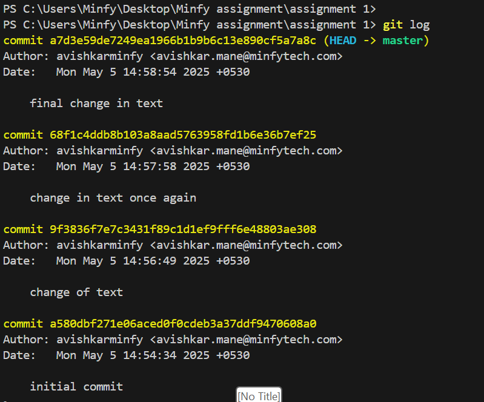

# Assignment 2
This repository contains Git basics practice.

#  Assignment 1 – Git Commit History Demo

This project demonstrates basic Git operations such as initializing a repository, staging files, making commits, and viewing commit history.

## Repository Overview

This repository contains a simple `sample.txt` file used to demonstrate Git commit flow using PowerShell on a Windows system.

##  Commit History

Below is a screenshot of the `git log` output and a brief description of each commit made during this assignment.

###  Git Log Output Screenshot

###  Commit Descriptions

| Commit Hash | Commit Message             | Description                                  |
|-------------|-----------------------------|----------------------------------------------|
| `a580dbf`   | initial commit              | Created the Git repository and added `sample.txt` with initial content. |
| `9f3836f`   | change of text              | Modified the content of `sample.txt`.        |
| `68f1c4d`   | change in text once again   | Updated the text in `sample.txt` again.      |
| `a7d3e59`   | final change in text        | Final modification of the `sample.txt` file. |

##  How to Reproduce

1. Run `git init` in your project folder.
2. Create a file like `sample.txt`.
3. Use `git add .` and `git commit -m "your message"` to track changes.
4. View history with `git log`.

# Assignment 2
_______________________________________________________________
Changing the readme file in feature brach and pushing to github 
_______________________________________________________________

